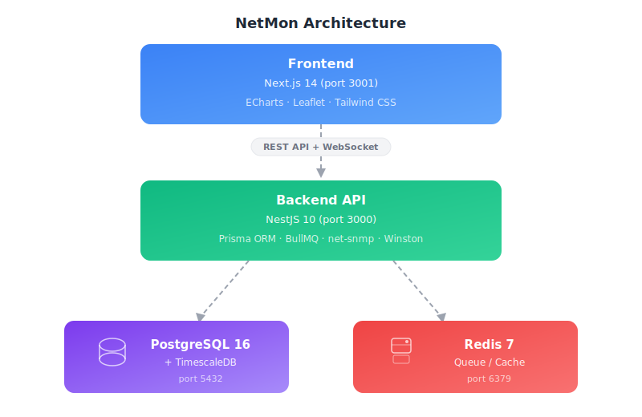

<div align="center">

# 🌐 NetMon

**Enterprise-grade SNMP network monitoring with real-time dashboards, alerting, and RRD-style performance graphs.**

[](https://nodejs.org/)
[](https://www.typescriptlang.org/)
[](https://nestjs.com/)
[](https://nextjs.org/)
[](https://www.timescale.com/)
[](https://redis.io/)
[](LICENSE)

</div>

---

## ✨ Features

| Category | Features |
|----------|----------|
| 📊 **Monitoring** | SNMP v1/v2c/v3 polling, auto-discovery of interfaces, CPU/Memory/Response time tracking |
| 📈 **RRD-Style Graphs** | Classic RRDtool-style performance charts with per-interface traffic In/Out bps |
| 🔔 **Alerting** | Threshold-based alerts with Telegram & Email notifications |
| 🗺️ **Network Map** | Device locations on interactive Leaflet maps |
| 🔐 **Auth** | JWT access & refresh tokens, role-based access control |
| ⚡ **Real-time** | WebSocket updates for device status changes |
| 📦 **Monorepo** | Turborepo-managed monorepo with shared packages |

---

## 🏗️ Architecture

<div align="center">
  
</div>

---

## 🚀 Quick Install (Linux / macOS)

Install NetMon on a fresh server with a single command:

```bash
curl -fsSL https://raw.githubusercontent.com/arramandhanu/bit-netmon/main/install.sh -o install.sh && \
chmod +x install.sh && sudo ./install.sh
```

Or clone the repo and run manually:

```bash
git clone https://github.com/arramandhanu/bit-netmon.git
cd bit-netmon
chmod +x install.sh
sudo ./install.sh
```

With a domain name (enables Nginx reverse proxy):

```bash
sudo API_DOMAIN=netmon.example.com ./install.sh
```

> **What the installer does:**
> 1. Detects your OS (Ubuntu/Debian, RHEL/CentOS/Fedora, macOS)
> 2. Installs Node.js 20, PostgreSQL 16 + TimescaleDB, Redis 7
> 3. Creates database & user with TimescaleDB extension
> 4. Generates `.env` with secure random secrets
> 5. Runs `npm install` → Prisma generate → DB migrations → Production build
> 6. Creates systemd services (`netmon-api`, `netmon-web`)
> 7. Optionally configures Nginx reverse proxy

---

## 🐳 Docker Install (Alternative)

If you prefer Docker, use the included Docker Compose setup:

```bash
git clone https://github.com/arramandhanu/bit-netmon.git
cd bit-netmon
cp .env.example .env    # Edit .env with your settings
npm run docker:dev:build
```

**Development:**
```bash
npm run docker:dev
```

**Production:**
```bash
docker compose --env-file .env.prod -f infra/docker-compose.prod.yml up -d
```

---

## 📋 Requirements

| Component | Version | Required |
|-----------|---------|----------|
| Node.js | ≥ 20 LTS | ✅ |
| PostgreSQL | 16 | ✅ |
| TimescaleDB | 2.14+ | ✅ |
| Redis | 7.x | ✅ |
| Nginx | latest | Optional (reverse proxy) |

> All dependencies are automatically installed by `install.sh`.

---

## ⚙️ Configuration

All configuration is in `.env` (auto-generated by installer):

| Variable | Default | Description |
|----------|---------|-------------|
| `DATABASE_URL` | auto | PostgreSQL connection string |
| `REDIS_HOST` | `localhost` | Redis host |
| `API_PORT` | `3000` | API server port |
| `WEB_PORT` | `3001` | Web frontend port |
| `JWT_SECRET` | auto | JWT signing secret (64 chars) |
| `ENCRYPTION_KEY` | auto | Encryption key (32 chars) |
| `SNMP_POLLING_INTERVAL` | `300` | Polling interval in seconds |
| `LOG_LEVEL` | `info` | Log level (`debug`, `info`, `warn`, `error`) |

---

## 🔧 Management Commands

### Service Management (Linux)

```bash
# Status
sudo systemctl status netmon-api netmon-web

# Restart
sudo systemctl restart netmon-api netmon-web

# View logs
sudo journalctl -u netmon-api -f
sudo journalctl -u netmon-web -f

# Stop
sudo systemctl stop netmon-api netmon-web
```

### Update

Pull latest changes, run migrations, rebuild, and restart:

```bash
sudo ./scripts/update.sh
```

### Uninstall

Remove services, optionally drop database:

```bash
sudo ./scripts/uninstall.sh
```

### Database

```bash
# Run migrations
npm run db:migrate

# Open Prisma Studio (GUI)
npm run db:studio

# Regenerate Prisma client
npm run db:generate
```

---

## 📁 Project Structure

```
netmon/
├── apps/
│   ├── api/                 # NestJS backend (REST + WebSocket + SNMP)
│   │   └── src/modules/     # Devices, Polling, Discovery, Auth, Alerts
│   ├── web/                 # Next.js frontend (Dashboard, Maps, Charts)
│   └── bull-board/          # BullMQ dashboard (dev only)
├── packages/
│   ├── database/            # Prisma schema & migrations
│   └── shared/              # Shared types & utilities
├── infra/                   # Docker Compose files
├── scripts/
│   ├── update.sh            # Update script
│   └── uninstall.sh         # Uninstall script
├── install.sh               # Bare-metal installer
├── .env.example             # Environment template
└── turbo.json               # Turborepo config
```

---

## 🛡️ Security

- JWT access tokens (15min) + refresh tokens (7d)
- SNMP credentials encrypted at rest with AES-256
- Systemd services run with `NoNewPrivileges`, `ProtectSystem`, `PrivateTmp`
- Role-based access control (admin, operator, viewer)
- Rate limiting on auth endpoints

---

## 🤝 Contributing

1. Fork the repository
2. Create your feature branch (`git checkout -b feat/amazing-feature`)
3. Commit your changes (`git commit -m 'feat: add amazing feature'`)
4. Push to the branch (`git push origin feat/amazing-feature`)
5. Open a Pull Request

---

## 📄 License

This project is licensed under the MIT License — see the [LICENSE](LICENSE) file for details.

---

<div align="center">

**Built with ❤️ for network engineers**

[Report Bug](https://github.com/arramandhanu/bit-netmon/issues) · [Request Feature](https://github.com/arramandhanu/bit-netmon/issues)

</div>
