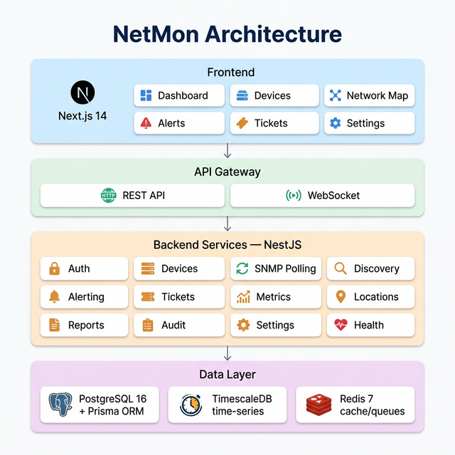
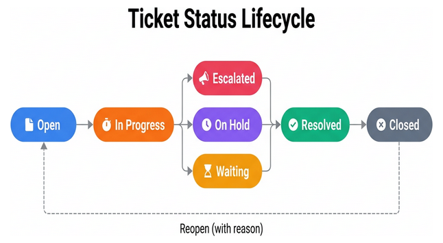
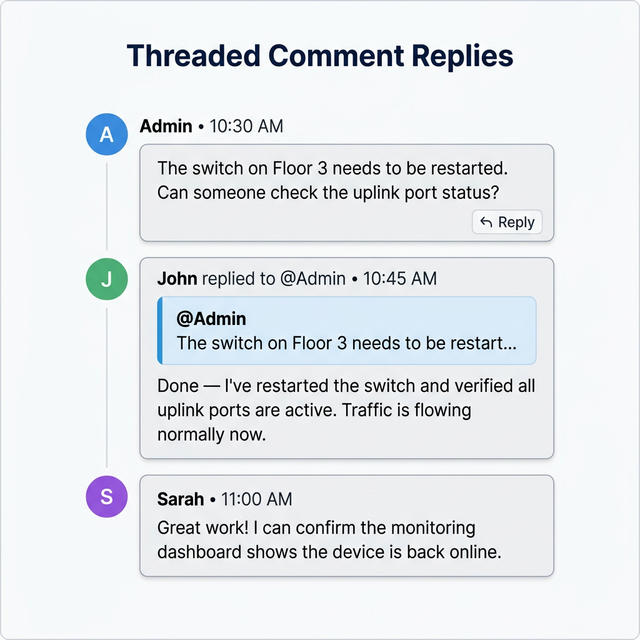

<div align="center">

# 🌐 NetMon

**Enterprise-grade SNMP network monitoring platform with real-time dashboards, alerting, ticketing, and RRD-style performance graphs.**

[](https://nodejs.org/)
[](https://www.typescriptlang.org/)
[](https://nestjs.com/)
[](https://nextjs.org/)
[](https://www.timescale.com/)
[](https://redis.io/)
[](LICENSE)

</div>

---

## 📖 Table of Contents

- [Features](#-features)
- [Architecture](#️-architecture)
- [Quick Install](#-quick-install-linux--macos)
- [Docker Install](#-docker-install)
- [Requirements](#-requirements)
- [Configuration](#️-configuration)
- [Ticketing System](#-ticketing-system)
- [API Reference](#-api-reference)
- [Management Commands](#-management-commands)
- [Database Schema](#️-database-schema)
- [Security](#️-security)
- [Contributing](#-contributing)
- [License](#-license)

---

## ✨ Features

### 📊 Monitoring & Discovery
| Feature | Description |
|---------|-------------|
| **SNMP Polling** | SNMPv1/v2c/v3 automated polling with configurable intervals |
| **Auto-Discovery** | Network device auto-discovery via SNMP scan on IP ranges |
| **Interface Tracking** | Automatic discovery and monitoring of all device interfaces |
| **Metrics Collection** | CPU, memory, response time, uplink/downlink bandwidth |
| **Real-time Updates** | WebSocket-powered live device status changes |

### 📈 Visualization
| Feature | Description |
|---------|-------------|
| **RRD-Style Graphs** | Classic RRDtool-style performance charts per interface (In/Out bps) |
| **Interactive Dashboard** | Overview with device health, alerts, and bandwidth widgets |
| **Network Map** | Device locations on interactive Leaflet maps with status indicators |
| **Traffic Analysis** | Per-interface traffic flow visualization with historical data |

### 🔔 Alerting & Notifications
| Feature | Description |
|---------|-------------|
| **Threshold Alerts** | Configurable threshold-based alerts (CPU, memory, bandwidth, latency) |
| **Alert States** | Active, acknowledged, resolved state machine |
| **Telegram** | Real-time alert notifications via Telegram bot |
| **Email** | SMTP-based email alert notifications |
| **Alert-to-Ticket** | Create support tickets directly from active alerts |

### 🎫 Ticketing System (ITIL/ITSM)
| Feature | Description |
|---------|-------------|
| **Ticket Lifecycle** | Full ITIL-compliant workflow: Open → In Progress → Escalated/On Hold → Resolved → Closed |
| **Threaded Comments** | Reply-to-comment threading with visual quote cards for traceable discussions |
| **Role-Based Access** | Admin-only delete, creator/admin reopen, comment restrictions on closed tickets |
| **Status Dashboard** | Clickable stat cards with real-time ticket counts per status |
| **Close/Reopen Workflow** | Mandatory reason comments when closing or reopening tickets |
| **Rich Formatting** | Markdown support with bold, italic, code, links, and @mentions |
| **Device Linking** | Associate tickets with monitored devices and alerts |
| **SLA Tracking** | Due dates, priority levels, and status-based SLA visibility |

### 🔐 Security & Access Control
| Feature | Description |
|---------|-------------|
| **JWT Authentication** | Access tokens (15min) + refresh tokens (7d) |
| **Role-Based Access** | Admin, operator, viewer roles |
| **Credential Encryption** | SNMP credentials encrypted at rest with AES-256 |
| **Audit Logging** | Track all user actions with audit trail |
| **Rate Limiting** | Protection on authentication endpoints |

---

## 🏗️ Architecture

<div align="center">
  
</div>

**Key Components:**
- **API Server** — NestJS with modular architecture (13 modules), Prisma ORM, BullMQ job queues
- **Web Frontend** — Next.js 14 with App Router, real-time WebSocket updates
- **Database** — PostgreSQL 16 with TimescaleDB for time-series metrics
- **Cache/Queue** — Redis 7 for caching, BullMQ SNMP polling job queues
- **SNMP Engine** — net-snmp library for device communication

---

## 🚀 Quick Install (Linux / macOS)

Install NetMon on a fresh server with a single command:

```bash
curl -fsSL https://raw.githubusercontent.com/arramandhanu/bit-netmon/main/install.sh | sudo bash
```

Or clone the repo and run manually:

```bash
git clone https://github.com/arramandhanu/bit-netmon.git
cd bit-netmon
chmod +x install.sh
sudo ./install.sh
```

With a domain name (enables Nginx reverse proxy):

```bash
sudo API_DOMAIN=netmon.example.com ./install.sh
```

> **What the installer does:**
> 1. Detects your OS (Ubuntu/Debian, RHEL/CentOS/Fedora, macOS)
> 2. Installs Node.js 20, PostgreSQL 16 + TimescaleDB, Redis 7
> 3. Creates database & user with TimescaleDB extension
> 4. Generates `.env` with secure random secrets
> 5. Runs `npm install` → Prisma generate → DB migrations → Seed → Production build
> 6. Creates systemd services (`netmon-api`, `netmon-web`)
> 7. Optionally configures Nginx reverse proxy with SSL support

### Installer Options

| Flag | Description |
|------|-------------|
| `--unattended` | Non-interactive mode using all defaults |
| `--version TAG` | Install a specific git tag or branch |
| `--nginx` | Set up Nginx reverse proxy only |
| `--help` | Show help message |

---

## 🐳 Docker Install

If you prefer Docker, use the included Docker Compose setup:

```bash
git clone https://github.com/arramandhanu/bit-netmon.git
cd bit-netmon
cp .env.example .env    # Edit .env with your settings
```

**Development:**
```bash
npm run docker:dev:build
npm run docker:dev
```

**Production:**
```bash
docker compose --env-file .env.prod -f infra/docker-compose.prod.yml up -d
```

### Docker Services

| Service | Port | Description |
|---------|------|-------------|
| `netmon-api` | 3000 | NestJS API server |
| `netmon-web` | 3001 | Next.js frontend |
| `postgres` | 5432 | PostgreSQL + TimescaleDB |
| `redis` | 6379 | Redis cache & queues |

---

## 📋 Requirements

| Component | Version | Required | Notes |
|-----------|---------|----------|-------|
| Node.js | ≥ 20 LTS | ✅ | Package manager: npm ≥ 10 |
| PostgreSQL | 16 | ✅ | With TimescaleDB 2.14+ extension |
| Redis | 7.x | ✅ | For caching and BullMQ job queues |
| Nginx | latest | Optional | Reverse proxy with SSL termination |
| Docker | 24+ | Optional | Alternative to bare-metal install |

> All dependencies are automatically installed by `install.sh`.

---

## ⚙️ Configuration

All configuration is in `.env` (auto-generated by installer):

### Database
| Variable | Default | Description |
|----------|---------|-------------|
| `POSTGRES_USER` | `netmon` | Database username |
| `POSTGRES_PASSWORD` | auto-generated | Database password |
| `POSTGRES_DB` | `netmon` | Database name |
| `DATABASE_URL` | auto | Full PostgreSQL connection string |

### Redis
| Variable | Default | Description |
|----------|---------|-------------|
| `REDIS_HOST` | `localhost` | Redis server host |
| `REDIS_PORT` | `6379` | Redis server port |
| `REDIS_PASSWORD` | auto-generated | Redis auth password |
| `REDIS_MAXMEMORY` | `512mb` | Redis memory limit |

### Application
| Variable | Default | Description |
|----------|---------|-------------|
| `NODE_ENV` | `production` | Environment mode |
| `API_PORT` | `3000` | API server port |
| `WEB_PORT` | `3001` | Web frontend port |
| `LOG_LEVEL` | `info` | Log level (`debug`, `info`, `warn`, `error`) |

### Security
| Variable | Default | Description |
|----------|---------|-------------|
| `JWT_SECRET` | auto (64 chars) | JWT signing secret |
| `JWT_EXPIRES_IN` | `15m` | Access token TTL |
| `JWT_REFRESH_EXPIRES_IN` | `7d` | Refresh token TTL |
| `ENCRYPTION_KEY` | auto (32 chars) | AES-256 encryption key for SNMP credentials |

### SNMP
| Variable | Default | Description |
|----------|---------|-------------|
| `SNMP_DEFAULT_TIMEOUT` | `5000` | SNMP request timeout (ms) |
| `SNMP_DEFAULT_RETRIES` | `1` | SNMP retry attempts |
| `SNMP_POLLING_INTERVAL` | `300` | Polling interval (seconds) |

### Notifications (Optional)
| Variable | Description |
|----------|-------------|
| `TELEGRAM_BOT_TOKEN` | Telegram bot API token |
| `TELEGRAM_CHAT_ID` | Telegram chat/group ID |
| `SMTP_HOST` | SMTP server hostname |
| `SMTP_PORT` | SMTP port (default: 587) |
| `SMTP_USER` | SMTP username |
| `SMTP_PASS` | SMTP password |

### Frontend
| Variable | Default | Description |
|----------|---------|-------------|
| `NEXT_PUBLIC_API_URL` | `http://localhost:3000/api/v1` | API base URL for frontend |
| `NEXT_PUBLIC_WS_URL` | `http://localhost:3000` | WebSocket URL |

---

## 🎫 Ticketing System

NetMon includes a built-in ITIL/ITSM-compliant ticketing system for managing network incidents and operational workflows.

### Ticket Statuses

<div align="center">
  
</div>

| Status | Description | Color |
|--------|-------------|-------|
| 🔵 **Open** | New ticket, awaiting assignment | Blue |
| 🟠 **In Progress** | Being actively worked on | Orange |
| 🔴 **Escalated** | Raised to higher support (L2/L3) | Rose |
| 🟣 **On Hold** | Intentionally paused (e.g., maintenance window) | Purple |
| ⏳ **Waiting** | Waiting for external input | Amber |
| 🟢 **Resolved** | Fix applied, pending verification | Emerald |
| ⬛ **Closed** | Completed and archived | Slate |

### Ticket Features

- **Priority Levels:** Low, Medium, High, Critical
- **Categories:** Incident, Problem, Change Request, Maintenance
- **Device Linking:** Associate tickets with monitored devices
- **Alert Integration:** Create tickets directly from active alerts
- **Due Dates:** SLA tracking with due date management
- **Attachments:** File upload support
- **Tags:** Flexible tag-based organization

### Threaded Comments

<div align="center">
  
</div>

- **@mention** auto-inserted when replying
- **Markdown formatting** — bold, italic, code, links, lists
- **Reply quote card** — visual reference to the parent comment
- **System comments** — automatic tracking of status/field changes

### Access Control

| Action | Admin | Ticket Creator | Other Users |
|--------|-------|----------------|-------------|
| Create ticket | ✅ | ✅ | ✅ |
| Edit ticket | ✅ | ✅ | ❌ |
| Delete ticket | ✅ | ❌ | ❌ |
| Comment (when open) | ✅ | ✅ | ✅ |
| Comment (when closed) | ❌ | ❌ | ❌ |
| Close ticket | ✅ | ✅ | ✅ |
| Reopen ticket | ✅ | ✅ | ❌ |

---

## 📡 API Reference

Base URL: `http://localhost:3000/api/v1`

### Authentication

| Method | Endpoint | Description |
|--------|----------|-------------|
| `POST` | `/auth/login` | Login with username/password |
| `POST` | `/auth/refresh` | Refresh access token |
| `POST` | `/auth/register` | Register new user (admin only) |
| `GET` | `/auth/me` | Get current user profile |

### Devices

| Method | Endpoint | Description |
|--------|----------|-------------|
| `GET` | `/devices` | List all devices (with pagination, filtering) |
| `GET` | `/devices/:id` | Get device detail with interfaces |
| `POST` | `/devices` | Add a new device |
| `PATCH` | `/devices/:id` | Update device |
| `DELETE` | `/devices/:id` | Delete device |

### Metrics & Polling

| Method | Endpoint | Description |
|--------|----------|-------------|
| `GET` | `/metrics/:deviceId` | Get device metrics (time range) |
| `GET` | `/metrics/:deviceId/interfaces` | Get interface traffic data |
| `POST` | `/polling/trigger/:deviceId` | Trigger immediate poll |

### Discovery

| Method | Endpoint | Description |
|--------|----------|-------------|
| `POST` | `/discovery/scan` | Start SNMP network discovery |
| `GET` | `/discovery/results` | Get discovery scan results |

### Alerts

| Method | Endpoint | Description |
|--------|----------|-------------|
| `GET` | `/alerts` | List all alerts (with filtering) |
| `GET` | `/alerts/:id` | Get alert detail |
| `PATCH` | `/alerts/:id/acknowledge` | Acknowledge alert |
| `PATCH` | `/alerts/:id/resolve` | Resolve alert |
| `POST` | `/alerts/:id/create-ticket` | Create ticket from alert |

### Tickets

| Method | Endpoint | Description |
|--------|----------|-------------|
| `GET` | `/tickets` | List tickets (paginated, filterable by status/priority/search) |
| `GET` | `/tickets/stats` | Get ticket statistics by status |
| `GET` | `/tickets/:id` | Get ticket detail with comments & attachments |
| `POST` | `/tickets` | Create new ticket |
| `PATCH` | `/tickets/:id` | Update ticket (status, priority, assignee, etc.) |
| `DELETE` | `/tickets/:id` | Delete ticket (admin only) |
| `POST` | `/tickets/:id/comments` | Add comment (supports `parentId` for threaded replies) |
| `POST` | `/tickets/:id/assign` | Assign ticket to user |

### Locations

| Method | Endpoint | Description |
|--------|----------|-------------|
| `GET` | `/locations` | List all locations |
| `POST` | `/locations` | Create location |
| `PATCH` | `/locations/:id` | Update location |
| `DELETE` | `/locations/:id` | Delete location |

### Settings

| Method | Endpoint | Description |
|--------|----------|-------------|
| `GET` | `/settings` | Get application settings |
| `PATCH` | `/settings` | Update application settings |

### Health

| Method | Endpoint | Description |
|--------|----------|-------------|
| `GET` | `/health` | Health check (DB, Redis, SNMP) |

---

## 🔧 Management Commands

### Service Management (Linux)

```bash
# Status
sudo systemctl status netmon-api netmon-web

# Restart
sudo systemctl restart netmon-api netmon-web

# View logs
sudo journalctl -u netmon-api -f
sudo journalctl -u netmon-web -f

# Stop
sudo systemctl stop netmon-api netmon-web
```

### Docker Management

```bash
# View logs
docker compose logs -f netmon-api
docker compose logs -f netmon-web

# Rebuild & restart
docker compose up --build -d

# Enter API container
docker exec -it netmon-api sh

# Run migration inside container
docker exec netmon-api npx prisma migrate deploy --schema /app/packages/database/prisma/schema.prisma
```

### Update

Pull latest changes, run migrations, rebuild, and restart:

```bash
sudo ./scripts/update.sh
```

### Uninstall

Remove services, optionally drop database:

```bash
sudo ./scripts/uninstall.sh
```

### Database

```bash
# Run migrations
npm run db:migrate

# Open Prisma Studio (GUI)
npm run db:studio

# Regenerate Prisma client
npm run db:generate

# Seed default admin user
npm run db:seed
```

---

## 🗄️ Database Schema

Key models in the Prisma schema:

| Model | Description |
|-------|-------------|
| `User` | Users with roles (admin, operator, viewer) |
| `Device` | Monitored network devices (switches, routers, APs) |
| `DeviceInterface` | Network interfaces per device |
| `Metric` | Time-series metrics (TimescaleDB hypertable) |
| `AlertRule` | Threshold-based alert rule definitions |
| `Alert` | Active/resolved alert instances |
| `Location` | Geographic locations for network map |
| `Ticket` | Support tickets with ITIL lifecycle |
| `TicketComment` | Threaded comments with parent-child relations |
| `TicketAttachment` | File attachments on tickets |
| `AuditLog` | User action audit trail |
| `Setting` | Application configuration key-value store |

### Ticket Status Enum

```prisma
enum TicketStatus {
  open
  in_progress
  waiting
  escalated
  on_hold
  resolved
  closed
}
```

---

## 🛡️ Security

- **Authentication:** JWT access tokens (15min) + refresh tokens (7d) with httpOnly cookies
- **Encryption:** SNMP credentials encrypted at rest with AES-256-GCM
- **RBAC:** Role-based access control (admin, operator, viewer)
- **Audit Trail:** All user actions logged with IP, user agent, and timestamps
- **Systemd Hardening:** `NoNewPrivileges`, `ProtectSystem=strict`, `PrivateTmp`
- **Rate Limiting:** Protection on authentication and sensitive endpoints
- **Input Validation:** class-validator DTOs on all API inputs
- **SQL Injection:** Prisma ORM with parameterized queries

---

## 🧪 Default Credentials

After installation, login with:

| Field | Value |
|-------|-------|
| Username | `admin` |
| Password | `admin` |

> ⚠️ **Change the default password immediately after first login!**

---

## 🤝 Contributing

1. Fork the repository
2. Create your feature branch (`git checkout -b feat/amazing-feature`)
3. Commit your changes (`git commit -m 'feat: add amazing feature'`)
4. Push to the branch (`git push origin feat/amazing-feature`)
5. Open a Pull Request

### Commit Convention

This project uses [Conventional Commits](https://www.conventionalcommits.org/):

| Prefix | Description |
|--------|-------------|
| `feat:` | New feature |
| `fix:` | Bug fix |
| `docs:` | Documentation |
| `refactor:` | Code refactoring |
| `perf:` | Performance improvement |
| `test:` | Test changes |
| `chore:` | Build/tooling changes |

---

## 📄 License

This project is licensed under the MIT License — see the [LICENSE](LICENSE) file for details.

---

<div align="center">

**Built with ❤️ for network engineers**

[Report Bug](https://github.com/arramandhanu/bit-netmon/issues) · [Request Feature](https://github.com/arramandhanu/bit-netmon/issues)

</div>
